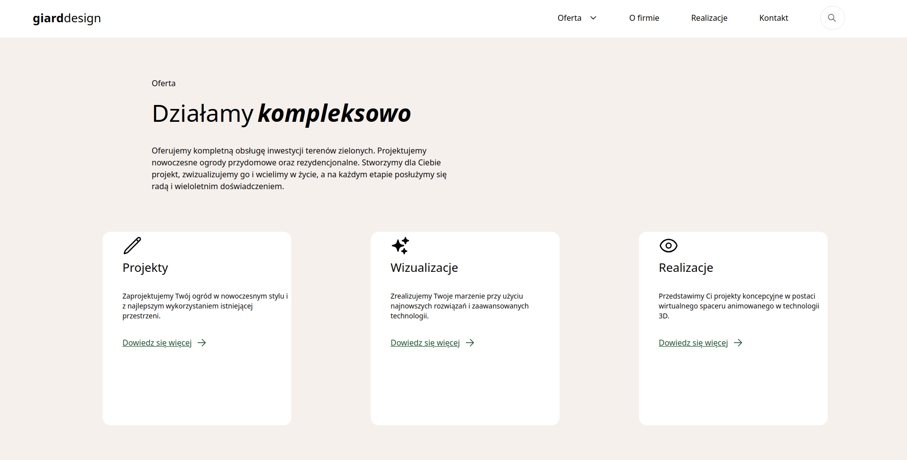

# adrespect_project

A sample landing page completed during the adRespect recruitment process. 

Live preview: <a href="https://wik95.github.io/adrespect_project/">CLICK HERE</a>

 This was my first time using Tailwind but I'm actually quite proud of my work, and now feel very comfortable using TailwindCSS. 

The page is responsive, and behaves accordingly depending on the screen size(mobile and tablet as well). 
When recreating the project that was assigned I used the 1880x890 screen-size so that's also where the project looks best. 

<h3>Most of the buttons on the page are clickable. Some of the animations I added besides "hover" are:</h3>
<ul></ul>
<li>a image carousel</li> 
<li>buttons that scroll down to a specific section of the page</li>
<li>two dropdown menu's</li>
<li>a pop-up search bar </li>
<li>a dropdown gallery </li>
<li>a pop-up gallery </li>
</ul>

 

The images I used are all copyright-free-images from Pixabay.

Once more I would like to emphasize that the design is owned by @adRespect. And I'd like to thank them for the opportunity
to evolve my skills. 

